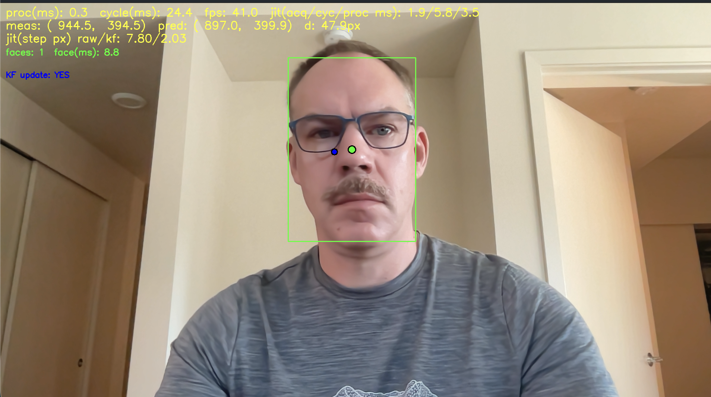

# Camera Tracking Pipeline (C++ / OpenCV)

A live camera tracking pipeline written in C++ using OpenCV. The project serves as a compact test bed for vision processing, object tracking, and multithreaded frame handoff.

The goal is to keep the design clean, modular, and reasonably efficient without overcomplicating the architecture. This is a low latency vision application running on a general purpose operating system, not intended for hard real time system.

## Demo



The live GUI displays the camera feed, detected target, Kalman-filter state, intermediate processing views, and basic runtime diagnostics. Green dot in center of face detection ROI, blue dot it KF estimation. 

## Key Features

* Camera capture using OpenCV
* Thread-safe frame handoff using a mutex and condition variable
* Modular processing stages for:

  * frame capture
  * vision processing
  * KF estimation
* Timestamped frames for basic latency measurement
* Live visualization with tracking overlays
* Debug views for intermediate stages, including:

  * raw camera input
  * thresholded images
  * final tracking output

## Architecture Overview

Rather than performing capture, processing, tracking, and visualization in a single loop, the pipeline is divided into components.

The goal is understand, modify, test, and extend.

## Components

* `FrameGrabber`
* `FrameQueue`
* `VisionProcessor`
* `Tracker`
* Visualization and diagnostics

### FrameGrabber

Handles camera input and timestamps each frame when it is captured.

### FrameQueue

Provides thread safe frame transfer between the capture and processing threads. This allows camera acquisition and vision processing to operate somewhat independently.

Depending on the application, the queue can be configured to prioritize the newest frame and discard stale frames to reduce accumulated latency.

### VisionProcessor

Runs on a separate thread and performs the main image processing operations, including:

* grayscale conversion
* thresholding
* contour detection
* target extraction
* tracker updates

### Tracker

Uses a Kalman filter to smooth noisy detections and provide short term state prediction when a valid measurement is temporarily unavailable.

### Visualization

Displays intermediate processing stages, final tracking results, and basic runtime information such as:

* whether the Kalman filter received a measurement
* measured and predicted target position
* frame processing latency
* processing rate

## Frames and Timestamping

Each captured image is stored with its acquisition timestamp:

```cpp
struct Frame {
    cv::Mat image;
    std::chrono::steady_clock::time_point timeStamp;
};
```


The timestamp travels with the image through the pipeline, allowing processing latency to be calculated at later stages without relying on the system wall clock.
